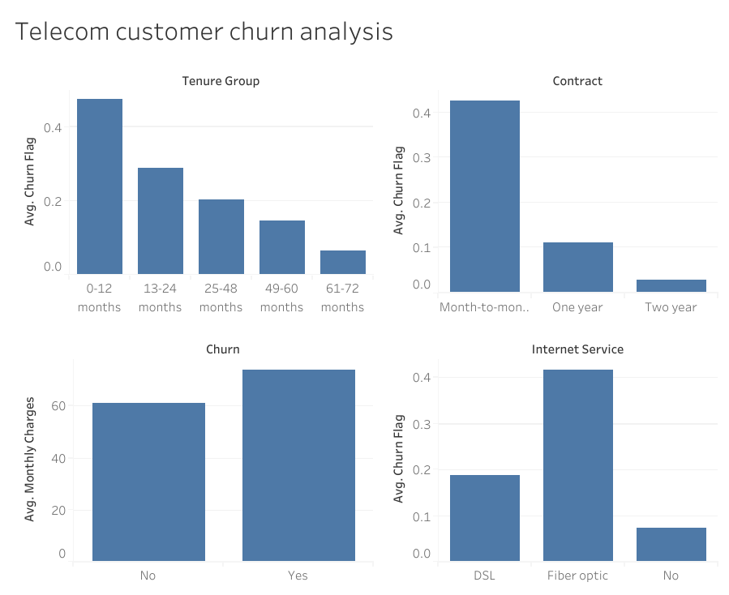

# Telecom Customer Churn Prediction Using Machine Learning

## Project Overview

Customer churn is a major challenge for subscription-based businesses. The objective of this project is to predict whether a customer is likely to leave a telecom service based on demographic information, account details, and service usage patterns.

The project uses Logistic Regression to classify customers as either:

- Churn = Yes
- Churn = No

---

## Dataset

Dataset: IBM Telco Customer Churn Dataset

Features include:

- Gender
- Senior Citizen
- Partner
- Dependents
- Tenure
- Phone Service
- Internet Service
- Contract Type
- Monthly Charges
- Total Charges

Target Variable:

- Churn

---

## Project Workflow

### 1. Data Loading

Loaded the telecom customer churn dataset using Pandas.

### 2. Data Cleaning

- Removed customerID column
- Handled missing values

### 3. Target Variable Encoding

Converted the target variable into numerical labels:

- No → 0
- Yes → 1

```python
y = df["Churn"].map({
    "No": 0,
    "Yes": 1
})
```

### 4. Feature Encoding

Categorical variables were converted into numerical form using One-Hot Encoding.

```python
X = pd.get_dummies(X, drop_first=True)
```

### 5. Train-Test Split

Dataset was split into:

- 80% Training Data
- 20% Testing Data

### 6. Model Training

Used Logistic Regression for binary classification.

```python
model = LogisticRegression(max_iter=1000)
```

### 7. Model Evaluation

Model performance was evaluated using:

- Accuracy
- Precision
- Recall
- F1 Score

---

## Tableau Dashboard

An interactive Tableau dashboard was built on the cleaned dataset to explore churn drivers visually.

**Live dashboard:** https://public.tableau.com/views/churn_17900856168180/Dashboard1



Key views:

- **Avg. Churn Rate by Tenure Group** — churn is highest among customers in their first 12 months and drops steadily the longer a customer stays.
- **Avg. Churn Rate by Contract Type** — month-to-month customers churn at a far higher rate than one- or two-year contract holders.
- **Avg. Monthly Charges by Churn** — customers who churn pay more per month on average than those who stay.
- **Avg. Churn Rate by Internet Service** — Fiber optic customers churn at a noticeably higher rate than DSL customers.

---

## Technologies Used

- Python
- Pandas
- NumPy
- Scikit-Learn
- Tableau

---

## Machine Learning Algorithm

### Logistic Regression

Logistic Regression was selected because:

- It is effective for binary classification tasks.
- It provides interpretable results.
- It serves as a strong baseline model for churn prediction.

---

## Business Impact

By identifying customers likely to churn, telecom companies can:

- Improve customer retention
- Reduce revenue loss
- Design targeted retention campaigns
- Improve customer satisfaction

---

## Future Improvements

- Random Forest Classifier
- XGBoost Classifier
- Hyperparameter Tuning
- Feature Importance Analysis
- Interactive Dashboard using Streamlit

---

## Author

Nasrin